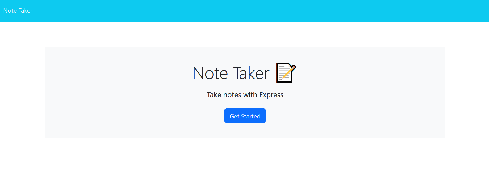
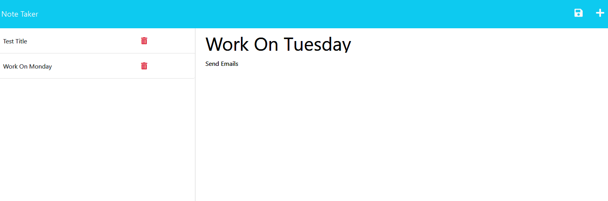

# Express.js: Note Taker

## Introduction:

Notes Taker application powered by Node js with clean code. You can quickly and easily create a your work notes.

You can enter note title and then enter ntoe text by clicking the add note button at top right of the page

## Developer Insights:

I am thankful to my instructors at RutgersCodingBootcamp, that they teach me so well and I have crated this coding application.

## Resources:

-   [W3SCHOOLS.COM](https://www.w3schools.com/nodejs/)
-   [NODEJS](https://www.w3schools.com/nodejs/)

## How to run:

You can run the application by opening the terminal in your MAC and type following:

NPM RUN START

## ScreenShots

The following images show the web application's appearance and functionality:
### Home Page

### Notes Page

### Notes Added

